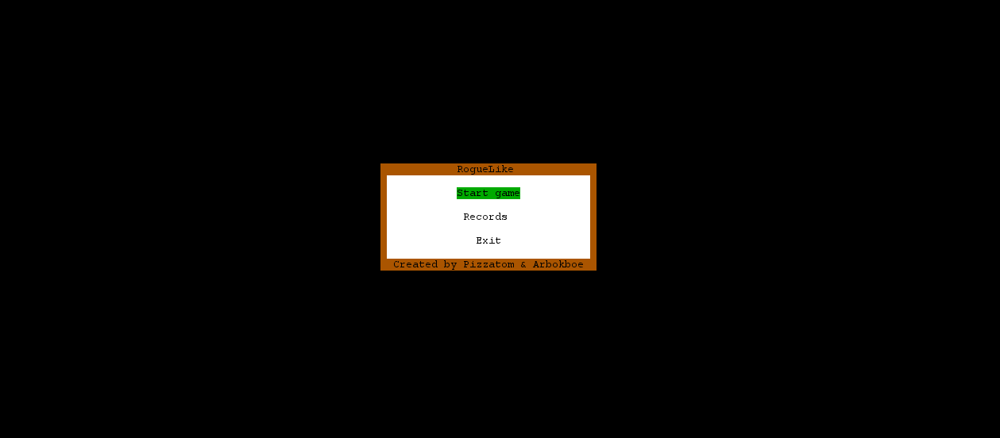

Roguelike 2.0: Путешествие в Бездну!

🚪 Цель игры:
Твоя миссия проста, но невероятно опасна: найти выход из каждого коварного уровня и спуститься на все 21 этаж подземелья. Сможешь ли ты достичь самой глубины? 💪

✨ Особенности, которые тебя затянут:

    Бесконечные Подземелья: Благодаря процедурной генерации, каждый уровень - это уникальное испытание! Ты никогда не знаешь, что ждет за следующим углом. 😲
    21 Этаж Ада: Спускайся все ниже и ниже, сложность растет, а враги становятся все более жуткими.
    Орды Врагов: Сразись с целым бестиарием разнообразных монстров, каждый со своими сильными и слабыми сторонами. Адаптируйся или умри! 💀
    Стань Легендой: Соревнуйся с друзьями и игроками со всего мира за место на вершине LeaderBoard! Докажи, что ты лучший выживший в этом подземелье. 🏆

🎮 Управление (Твои Инструменты Выживания):

    w - Шаг вперед, навстречу неизвестности!
    a - Движение влево, обходи ловушки.
    s - Шаг назад, тактическое отступление.
    d - Движение вправо, ищи проходы.
    i - Открой свой верный инвентарь, чтобы использовать найденное. 🎒
    esc - Пауза или выход в меню игры, если нужен перерыв от опасностей.

💎 Предметы (Найдешь или Потеряешь?):

    coin - Блестящие монеты! Собирай их, чтобы ставить новые рекорды и хвастаться перед друзьями! ✨
    eat - Еда! Восстанавливает здоровье и даже немного увеличивает твой максимальный запас сил. Жизненно важно! 🍎🍗
    elixir - Таинственные эликсиры. Могут как спасти тебя, наделив мощными баффами, так и отравить... Пей на свой страх и риск! 🧪
    scroll - Древние свитки. Их магия непредсказуема! Свиток может даровать могущественную силу или обернуться смертельным проклятием. Используй с умом! 📜
    weapon - Оружие! В руках умелого героя меч, топор или посох станет решающим аргументом в борьбе с обитателями подземелья. Выбери свое! ⚔️🛡️

📦 Рюкзак (Твой Мобильный Склад):

    Твой надежный рюкзак готов вместить до 9 предметов каждого типа. Управляй своими запасами мудро – каждый слот на счету в этом опасном приключении!

Удачи в подземельях, герой! 💪🛡️

