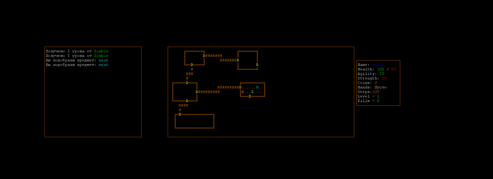

Roguelike 2.0

Цель игры
Найти выход на каждом уровне и так дойти до 21 уровня

Особенности
- Процедурная генерация подземелий, каждый уровень будет уникальным
- 21 уровень
- Множество разнообразных врагов
- Соревнуйся и добивайся новых рекордов, есть поддержка leaderBoard
  
Управление
w - движение вперед
a - движение влево
s - движение вниз
d - движение вправо
i - инвентарь 
esc- меню игры

Предметы
coin - собирай больше монет и побивай рекорды друзей!
eat - восстанавливают уровень здоровья и немного увеличивают max здоровье игрока
elixir - различные эликсиры дают как положительные так и отрицательные эффекты
scrol - свитки могут как дать тебе пользу так и убить
weapon - в умелых руках оружие поможет тебе в этом подземелье

Рюкзак
рюкзак - вмещает в себя до 9 предметов каждого типа

